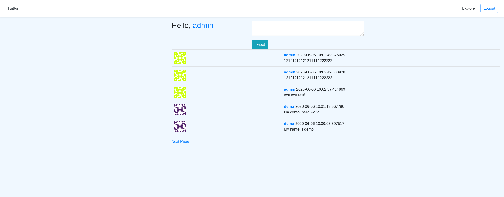
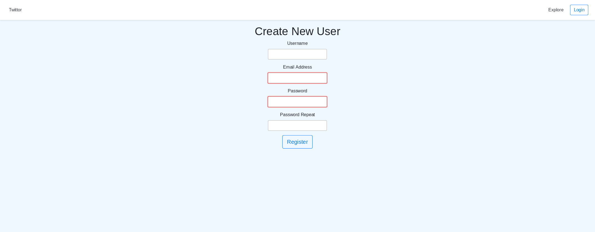
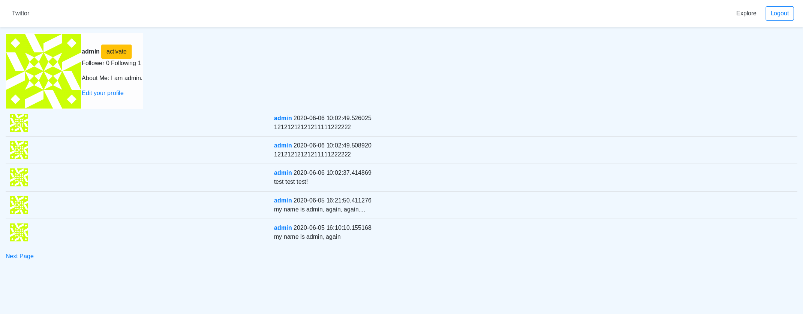
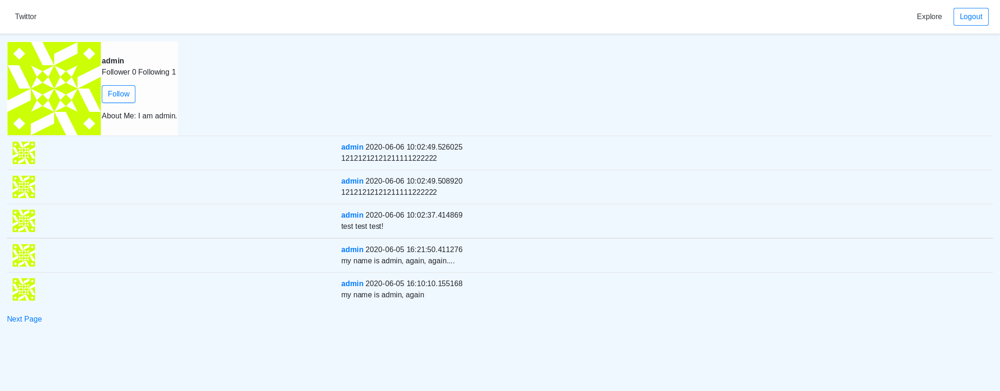

此為centos7下開發，請先閱讀setup_aws.md，安裝所需環境，包括git、docker、docker-compose

安裝完成後，請執行以下指令

cd twittor-demo

docker-compose up -d

docker ps -a #確認image有無正常運作

若發生網頁端的image無正常運作，原因為run_server.sh若是在windows端上的git抓取會發生檔案格式變動導致找不到此檔，請重新下載，輸入以下指令

git clone https://github.com/god-of-thunder/twittor-demo.git --config core.autocrlf=false

重新執行5~9行，確認運作正常，請開啟網頁輸入0.0.0.0:8000

username:admin password:admin 可登入帳號密碼

首頁

註冊

搜尋

個人頁面

追蹤

